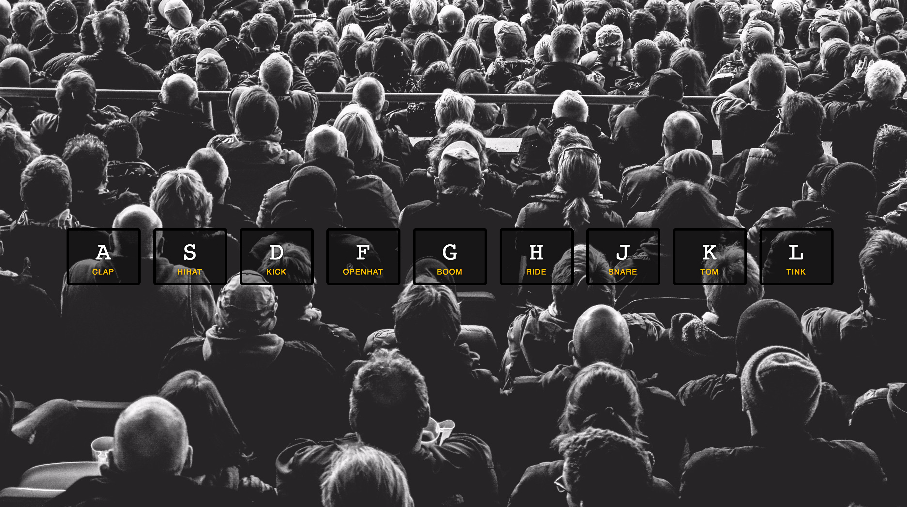

# Drumkit
### Javascript 30: Challenge 1
Drum Sounds App - Practice a drum solo with your computer's keyboard! Press any of the listed keys to play the associated sound. 

### Instructions
1. Download the repository
2. Double click `index.html`
3. Turn up the volume and view in your browser

### Technology
* Vanilla JS
* HTML5 & CSS3

### Credits
This project is part of the [Javascript 30 Challenge](https://javascript30.com) by Wes Bos. He provided all HTML and CSS files. 

The JS was written by me and is free to use as needed.
